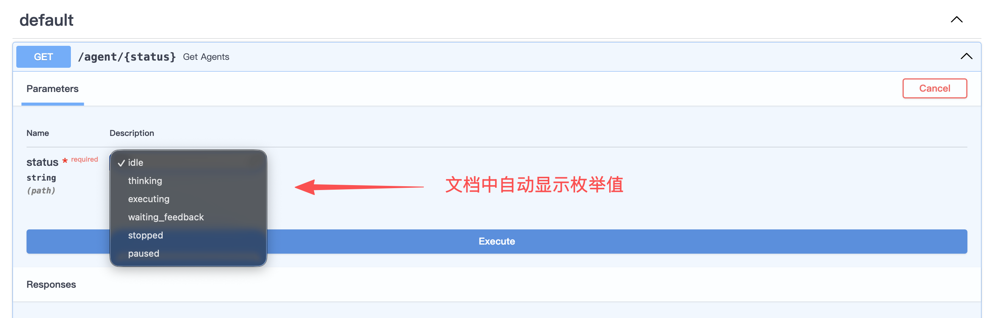

# Agent项目的FastAPI最佳实践
> 本项目参考了 [fastapi-best-practices](https://github.com/zhanymkanov/fastapi-best-practices) 。针对 Agent web 服务开发进行大量修改。项目少数部分内容与 FastAPI 无关，仅用于 Agent 项目。

## 项目结构
```
.
├── .env
├── .gitignore
├── .python-version
├── src/                        # 应用的最高层级目录
│   ├── module01/               # 某个模块目录
│   │   ├── __init__.py
│   │   ├── constants.py        # 模块常量和错误码
│   │   ├── dependencies.py     # 模块依赖项
│   │   ├── exceptions.py       # 模块自定义异常
│   │   ├── models.py           # 模块数据库模型
│   │   ├── router.py           # 模块路由
│   │   ├── schemas.py          # 模块 Pydantic 模型
│   │   ├── service.py          # 模块业务逻辑
│   │   └── utils.py            # 模块非业务逻辑函数
│   ├── config.py               # 全局配置
│   ├── constants.py            # 全局常量和错误码
│   ├── database.py             # 全局数据库模型
│   ├── dependencies.py         # 全局依赖项
│   ├── main.py                 # 项目入口
│   ├── models.py               # 全局数据库模型
│   ├── service.py              # 全局业务逻辑
│   └── utils/                  # 全局非业务逻辑函数
│       └── logger.py           # 全局日志记录器
├── docs/                       # 文档目录
├── pyproject.toml              # 项目依赖管理文件
├── README.md
└── tests/                      # 测试目录
```
1. 所有领域模块目录存放于 `src` 目录下。
   1. src/ - 应用的最高层级，包含通用模型、配置项和常量等
   2. src/main.py - 项目入口，初始化 FastAPI 应用
2. 每个 module 都有自己的router、schemas、models 等：
    1. router.py - 每个模块的核心，包含所有接口定义
    2. schemas.py - 定义 Pydantic 模型
    3. models.py - 定义数据库模型
    4. service.py - 模块内的业务逻辑
    5. dependencies.py - 路由依赖
    6. constants.py - 模块常量和错误码
    7. ~~config.py - 模块配置项（例如环境变量）~~
    8. utils.py - 非业务逻辑函数，例如响应格式化、数据补充等
    9. exceptions.py - 模块自定义异常，例如 PostNotFound、InvalidUserData
3. API KEY、密码等敏感信息存放在 .env 文件中，并且应该在 .gitignore 中忽略该文件。
4. 引入服务、依赖或常量时，不允许相对引入。

## 模型配置
[models.dev](https://models.dev) Models.dev是一个全面的AI模型的开源数据库。这对 Agent 项目的开发非常有帮助，提供了所有主流 AI 模型的详细信息。
本项目在`src/config.py`定义了 `get_profile` 函数，用于获取模型配置。输入你的供应商和模型名称，即可获取该模型的配置信息。其中包括API价格、上下文长度、输出长度、支持的模态（如文本、图像等）、是否支持工具调用等。
```python
from config import get_profile

# 聊天模型
profile = get_profile("deepseek", "deepseek-chat")
# 输出
# {
#     'attachment': True,
#     'cost': {'cache_read': 0.028, 'input': 0.28, 'output': 0.42},
#     'id': 'deepseek-chat',
#     'knowledge': '2024-07',
#     'last_updated': '2025-09-29',
#     'limit': {'context': 128000, 'output': 8192},
#     'modalities': {'input': ['text'], 'output': ['text']},
#     'model_provider': 'deepseek',
#     'name': 'DeepSeek Chat',
#     'open_weights': False,
#     'reasoning': False,
#     'release_date': '2024-12-26',
#     'temperature': True,
#     'tool_call': True
#  }

# 嵌入模型
profile = get_profile("OpenAI", "text-embedding-3-small")
# 输出：
# {
#     'attachment': False,
#     'cost': {'input': 0.02, 'output': 0},
#     'id': 'text-embedding-3-small',
#     'last_updated': '2024-01-25',
#     'limit': {'context': 8191, 'output': 1536},
#     'modalities': {'input': ['text'], 'output': ['text']},
#     'model_provider': 'azure',
#     'name': 'text-embedding-3-small',
#     'open_weights': False,
#     'reasoning': False,
#     'release_date': '2024-01-25',
#     'tool_call': False
# }
```
> ps: 你甚至可以用[models.dev](https://models.dev)比价，用来挑选更经济的模型。

## 异步接口
Agent 应用中 I/O 密集型任务较多，如流式聊天接口。因此，所有这类接口都应该使用 `async def` 定义。
```python
# service.py
# 流式聊天函数
async def stream_generator():
    async for chunk in chat_model.astream("hi!"):  # 假装有个chat_model
        yield f"data: {chunk}\n\n"
```
```python
# 在对应的 router.py 中编写接口
# 流式聊天接口
from fastapi import APIRouter
from fastapi.responses import StreamingResponse

from service import stream_generator

router = APIRouter()

@router.get("/stream")
async def stream():
    return StreamingResponse(
            stream_generator(), 
            media_type="text/event-stream"
        )

```
异步接口发生了什么：
在这个示例中，`stream_generator` 是一个异步生成器，可以在生成过程中挂起。使用 async for 循环异步迭代模型的输出，在等待模型生成下一个块时，事件循环可以处理其他请求。迭代到新的数据块时，则立即 yield 返回给客户端。

## enum
> [enum 官方指南](https://docs.python.org/zh-cn/3/howto/enum.html)

使用 `enum.Enum` 定义状态机与角色等有限的选项集合。enum 不仅可以实现代码自解释，还可以与FastAPI无缝集成，自动生成API文档。
另外，所有用于 API 和消息传递的 Enum，都应继承 `str`。
```python
from enum import Enum
from fastapi import APIRouter

router = APIRouter()

# 使用 enum 定义 Agent 状态
class AgentStatus(str, Enum):  # 继承 str
    IDLE = "idle"
    THINKING = "thinking"
    EXECUTING = "executing"
    WAITING_FEEDBACK = "waiting_feedback"
    STOPPED = "stopped"
    PAUSED = "paused"

@router.get("/agent/{status}")
def get_agents(status: AgentStatus):  # 在 type hint 中使用
    return {"msg": f"筛选状态为：{status.value}"}
```


需要注意的是，enum 不应该被滥用，只适用于 **静态、有限、未来不易变更** 的值。
## Pydantic 
> [Pydantic文档](https://pydantic.com.cn/)

Pydantic 是处理 Agent 复杂数据流配置和验证的核心。
除了常规的字段要求（如必需字段、非必需字段、默认值等），Pydantic 还内置了全面的数据处理工具，如正则表达式、枚举、字符串操作、电子邮件验证等。


## 日志
> [loguru 文档](https://loguru.readthedocs.io/en/stable/)

相比 Python 的内置日志模块 logging，`Loguru` 更易于配置，支持链式调用、颜色高亮和日志分级等丰富功能。
本项目已经配置好日志系统。你只需要在每个模块的 `__init__.py` 中引入 `logger` ，并修改变量 `module_name` 即可。
```python
from src.utils.logger import logger

module_name = "your_module_name"  # 修改这里

logger = init_logger()
logger.bind(module=module_name)
```

你可以查看`src/utils/logger.py`代码，它有如下优点
- 开箱即用，无需任何修改。
- 全局单例，避免多个日志实例争夺资源。
- 环境自动适配，只需在 `.env` 文件中设置 `PROJECT_ENV` 为 `dev` 或 `prod`。
- 日志分级处理，错误日志单独记录。
- 异步写入，不会阻塞主线程。
- 滚动存储，避免无限增长。

其中生产环境与开发的不同在于：
| 生产环境 | 开发环境 |
| -------- | -------- |
| 最低日志级别为 `INFO` | 最低日志级别为 `DEBUG` |
| 日志保存到 `logs/` 目录 | 打印到终端，不保存 |
| ERROR 日志单独保存 | 不保存 |